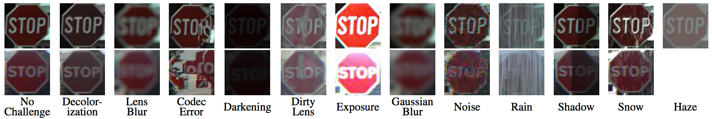
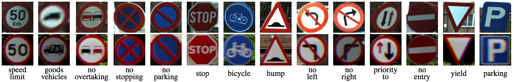
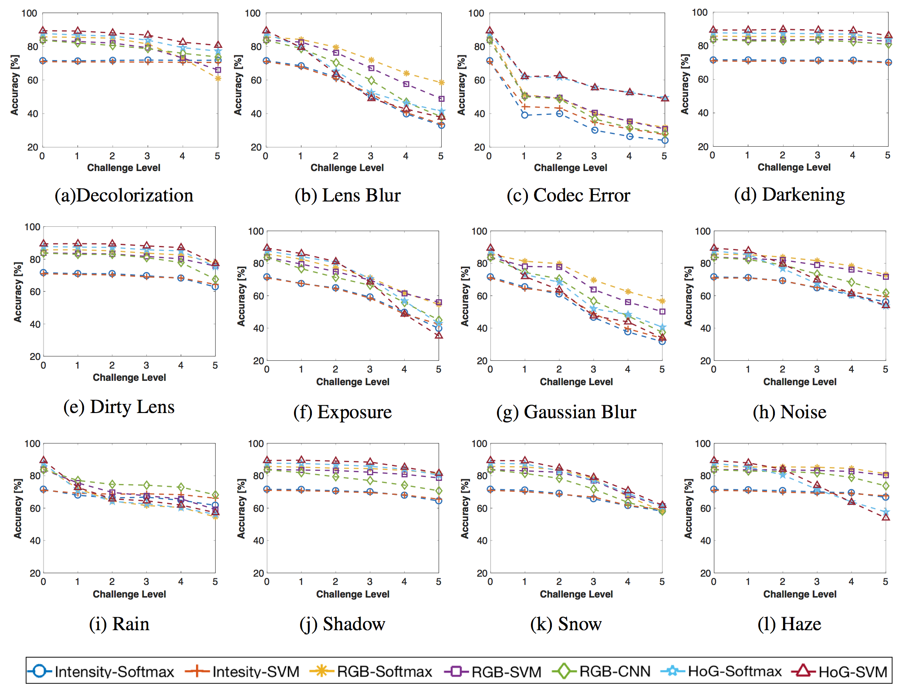

# CURE-TSR

[OLIVES Lab, Georgia Institute of Technology](https://ghassanalregib.com/)

The overall goal of this project is to analyze the robustness of data-driven algorithms under diverse challenging conditions where trained models can possibly be depolyed. To achieve this goal, we introduced a large-sacle (>2M images) recognition dataset (CURE-TSR) which is among the most comprehensive dataset with controlled synthetic challenging conditions. Also, this repository contains codes to reproduce the benchmarking result for CNN presented in our NIPS workshop paper. For detailed information, please refer to our paper [CURE-TSR: Challenging Unreal and Real Environments for Traffic Sign Recognition](https://arxiv.org/abs/1712.02463).

### Publications
If you use CURE-TSR dataset or codes, please cite:

 [CURE-TSR: Challenging unreal and real environments for traffic sign recognition](https://arxiv.org/abs/1712.02463)
  
```
@INPROCEEDINGS{Temel2017_NIPSW,
Author = {D. Temel and G. Kwon and M. Prabhushankar and G. AlRegib},
Title = {{CURE-TSR: Challenging unreal and real environments for traffic sign recognition}},
Year = {2017},
booktitle = {Neural Information Processing Systems (NeurIPS) Workshop on Machine Learning for Intelligent Transportation Systems},

```
   
 [Challenging Environments for Traffic Sign Detection: Reliability Assessment under Inclement Conditions](https://arxiv.org/abs/1902.06857)

```
@INPROCEEDINGS{Temel2019,
author = {D. Temel and T. Alshawi and M.-H. Chen and G. AlRegib},
booktitle={arXiv:1902.06857},
title = {Challenging Environments for Traffic Sign Detection: Reliability Assessment under Inclement Conditions},
year = {2015},
}
```

 [Traffic Signs in the Wild: Highlights from the IEEE Video and Image Processing Cup 2017 Student Competition [SP Competitions]
](https://arxiv.org/abs/1810.06169)

```
@ARTICLE{Temel2018_SPM,
author={D. Temel and G. AlRegib},
journal={IEEE Sig. Proc. Mag.},
title={Traffic Signs in the Wild: Highlights from the IEEE Video and Image Processing Cup 2017 Student
Competition [SP Competitions]},
year={2018},
volume={35},
number={2},
pages={154-161},
doi={10.1109/MSP.2017.2783449},
ISSN={1053-5888},}
```


### Download Dataset
Traffic sign images in the CURE-TSR dataset were cropped from the CURE-TSD dataset, which includes around 1.7 million real-world and simulator images with more than 2 million traffic sign instances. Overall, there is around 2.2 million traffic sign images in the CURE-TSR dataset. Sign types include speed limit, goods vehicles, no overtaking, no stopping, no parking, stop, bicycle, hump, no left, no right, priority to, no entry, yield, and parking. To receive  the download link, please fill out this [form](https://docs.google.com/forms/d/e/1FAIpQLSfjG211OENp4_QKFh86wLtFh-sa4HwkKq4hoWcAVKXN2QyICw/viewform) and agree the conditions of use. These information will be kept confidential and will not be released to anybody outside the OLIVES administration team. 

### Challenging Conditions
<p align="center">

</p> 

### Sign types
<p align="center">

</p> 


### File Name Format
The name format of the provided video sequences is as follows:
"sequenceType_signType_challengeType_challengeLevel_Index.bmp"

* sequenceType:
01 - Real data
02 - Unreal data

* signType:
01 - speed_limit
02 - goods_vehicles
03 - no_overtaking
04 - no_stopping
05 - no_parking
06 - stop
07 - bicycle
08 - hump
09 - no_left
10 - no_right
11 - priority_to
12 - no_entry
13 - yield
14 - parking

* challengeType:
00 - No challenge
01 - Decolorization
02 - Lens blur
03 - Codec error
04 - Darkening
05 - Dirty lens
06 - Exposure
07 - Gaussian blur
08 - Noise
09 - Rain
10 - Shadow
11 - Snow
12 - Haze

* challengeLevel:
A number in between [01-05] where 01 is the least severe and 05 is the most severe challenge.

* Index:
A number shows different instances of traffic signs in the same conditions.


# CURE-TSR Paper Code

### Requirements
- Tested on Linux 14.04
- CUDA, CuDNN
- Anaconda (or virtualenv)
- PyTorch (www.pytorch.org)
- Optionally, tensorflow-cpu for tensorboard


### Usage

```
usage: train.py [-h] [-j N] [--epochs N] [--start-epoch N] [-b N] [--lr LR]
                [--momentum M] [--weight-decay W] [--print-freq N]
                [--resume PATH] [-e]
                DIR

CURE-TSR Training and Evaluation

positional arguments:
  DIR                   path to dataset

optional arguments:
  -h, --help            show this help message and exit
  -j N, --workers N     number of data loading workers (default: 4)
  --epochs N            number of total epochs to run
  --start-epoch N       manual epoch number (useful on restarts)
  -b N, --batch-size N  mini-batch size (default: 256)
  --lr LR, --learning-rate LR
                        initial learning rate
  --momentum M          momentum
  --weight-decay W, --wd W
                        weight decay (default: 1e-4)
  --print-freq N, -p N  print frequency (default: 10)
  --resume PATH         path to latest checkpoint (default: none)
  -e, --evaluate        evaluate model on validation set
```

- Training example:
```
python train.py --lr 0.001 ./CURE-TSR
```
- Testing example: You need to change the variable 'testdir' to test trained models on different challenging conditions. 

```
python train.py -e --resume  ./checkpoints/checkpoint.pth.tar
```

## Output example

```
*** Start Training *** 

Epoch: [55][0/29]       Time 0.258 (0.258)      Data 0.251 (0.251)      Loss 0.1454 (0.1454)  Prec@1 95.312 (95.312)  Prec@5 99.609 (99.609)
Epoch: [55][10/29]      Time 0.024 (0.048)      Data 0.021 (0.044)      Loss 0.1117 (0.1493)  Prec@1 96.875 (96.165)  Prec@5 99.609 (99.751)
Epoch: [55][20/29]      Time 0.120 (0.043)      Data 0.116 (0.039)      Loss 0.1565 (0.1480)  Prec@1 94.922 (96.112)  Prec@5 100.000 (99.814)

*** Start Testing *** 

Test: [0/14]    Time 0.227 (0.227)      Loss 1.2593 (1.2593)    Prec@1 66.406 (66.406)        Prec@5 94.922 (94.922)
Test: [10/14]   Time 0.005 (0.037)      Loss 2.2871 (0.9604)    Prec@1 62.109 (78.871)        Prec@5 87.109 (94.602)
 * Prec@1 81.254 Prec@5 94.991
```

### CURE-TSR Results
We benchmark the performance of algorithms in real-world scenarios and analyze the performance variation with respect to challenging conditions. Below figure shows the accuracy of baseline methods with respect to challenge levels for each challenge type. We show that challenging conditions can decrease the performance of baseline methods significantly, especially if these challenging conditions result in loss or misplacement of spatial information.
<p align="center">

</p> 


# Related Research Studies
The following papers used the CURE-TSR dataset in their research studies. If you utilize or refer to CURE-TSR dataset, please  email cantemel@gatech.edu for your publication to be listed here.

<ul>
<li>G. Kwon, M. Prabhushankar,&nbsp;D. Temel, and G. AlRegib, “Distorted Representation Space Characterization through Backpropagated Gradients ,” accepted to the IEEE International Conference on Image Processing, Taipei, Taiwan, September 2019.</li>
<li>M. Prabhushankar*, G. Kwon*, D. Temel, and G. AlRegib, “Semantically Interpretable and Controllable Filter Sets,”&nbsp;<i>IEEE International Conference on Image Processing (ICIP)</i>, Athens, Greece, Oct. 7-10, 2018.</li>
<li>S. Vandenhende, B. De Brabandere, D. Neven and L. Van Gool, "A Three-Player GAN: Generating Hard Samples To Improve Classification Networks ," arXiv:1903.03496, 2019.</li>
</ul>
